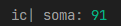
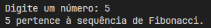
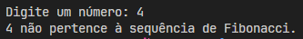
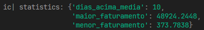
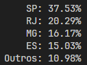
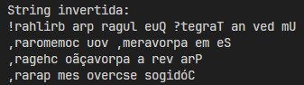

# Target Sistemas

Este repositório contém uma série de exercícios em Python desenvolvidos como parte de um processo seletivo para a Target
Sistemas.

## Índice de Exercícios

- [Exercício 1](#exercício-1)
- [Exercício 2](#exercício-2)
- [Exercício 3](#exercício-3)
- [Exercício 4](#exercício-4)
- [Exercício 5](#exercício-5)

## Exercícios e Saídas

### Exercício 1

#### Enunciado

Observe o trecho de código abaixo:

```text
int
INDICE = 13, SOMA = 0, K = 0;
Enquanto
K < INDICE
faça
{
    K = K + 1;
    SOMA = SOMA + K;
}
Imprimir(SOMA);
```

Ao final do processamento, qual será o valor da variável `SOMA`?

#### Arquivo e Saída

Arquivo: [`ex01.py`](ex01.py)  
Saída:  


### Exercício 2

#### Enunciado

Dado a sequência de Fibonacci, onde se inicia por 0 e 1 e o próximo valor sempre será a soma dos 2 valores anteriores (
exemplo: 0, 1, 1, 2, 3, 5, 8, 13, 21, 34...), escreva um programa na linguagem que desejar onde, informado um número,
ele calcule a sequência de Fibonacci e retorne uma mensagem avisando se o número informado pertence ou não à sequência.

#### Arquivo e Saída

Arquivo: [`ex02.py`](ex02.py)  
Saídas:  
  


### Exercício 3

#### Enunciado

Dado um vetor que guarda o valor de faturamento diário de uma distribuidora, faça um programa, na linguagem que desejar,
que calcule e retorne:

- O menor valor de faturamento ocorrido em um dia do mês;
- O maior valor de faturamento ocorrido em um dia do mês;
- Número de dias no mês em que o valor de faturamento diário foi superior à média mensal.

**IMPORTANTE:**

- a) Usar o JSON ou XML disponível como fonte dos dados do faturamento mensal;
- b) Podem existir dias sem faturamento, como nos finais de semana e feriados. Estes dias devem ser ignorados no cálculo
  da média.

#### Arquivo e Saída

Arquivo: [`ex03.py`](ex03.py)  
Saída:  


### Exercício 4

#### Enunciado

Dado o valor de faturamento mensal de uma distribuidora, detalhado por estado:

- SP – R$67.836,43
- RJ – R$36.678,66
- MG – R$29.229,88
- ES – R$27.165,48
- Outros – R$19.849,53

Escreva um programa na linguagem que desejar onde calcule o percentual de representação que cada estado teve dentro do
valor total mensal da distribuidora.

#### Arquivo e Saída

Arquivo: [`ex04.py`](ex04.py)  
Saída:  


### Exercício 5

#### Enunciado

Escreva um programa que inverta os caracteres de um string.

**IMPORTANTE:**

- a) Essa string pode ser informada através de qualquer entrada de sua preferência ou pode ser previamente definida no
  código;
- b) Evite usar funções prontas, como, por exemplo, `reverse`.

#### Arquivo e Saída

Arquivo: [`ex05.py`](ex05.py)  
Saída:  

